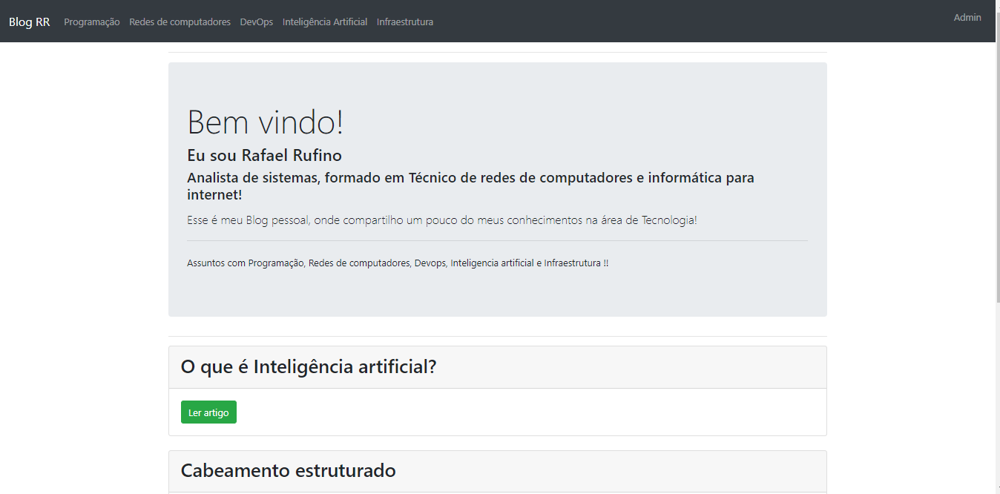

<h1 align="center">
  Blog RR
</h1>

  <a href="#-tecnologias">Tecnologias</a>&nbsp;&nbsp;&nbsp;|&nbsp;&nbsp;&nbsp;
  <a href="#-projeto">Projeto</a>&nbsp;&nbsp;&nbsp;|&nbsp;&nbsp;&nbsp;
  <a href="#-layout">Layout</a>&nbsp;&nbsp;&nbsp;|&nbsp;&nbsp;&nbsp;
  <a href="#memo-licença">Licença</a>

 

  

 

  

##  Projeto de Blog criado durante o curso de formação nodeJS do guia do programador.
 

## features

### * Crud ( show, create, edit, delete) 
### * Aréa restrita para Admin 
### * Autenticação 
### * Divisão por categorias
### * Paginação

 

## 🚀 Tecnologias

Esse projeto foi desenvolvido com as seguintes tecnologias:

- HTML
- Bootstrap
- JavaScript
- NodeJS
- EJS
- Express
- Mysql

## 💻 Projeto

O Blog RR é uma aplicação na qual construir pra compartilhar conhecimentos ao longo da minha formação Academica em Tecnologia em analista e desenvolvimento de sistemas. 

## :memo: Licença

Esse projeto está sob a licença MIT. Veja o arquivo [LICENSE](./LICENSE.md) para mais detalhes.

---

Feito com ♥ by Rafael Rufino :wave: [Linkedin!](https://www.linkedin.com/in/rafael-r-dos-santos-b889311ba/)
